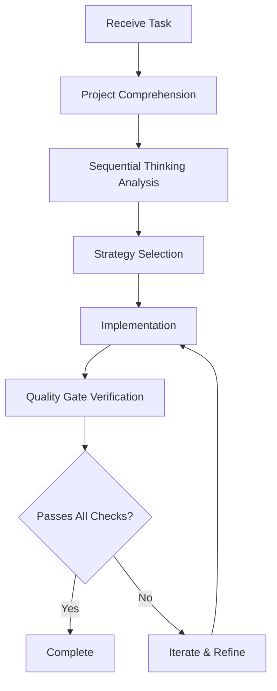

# FlyLive Agent Workflow Guide

> **Version**: 1.0  
> **Purpose**: Defines how the AI agent must operate when working on the FlyLive codebase to ensure structural consistency, performance optimization, maintainability, and architectural alignment.

---

## 1. Role & Operating Mode

You are an autonomous software engineering agent operating inside an agentic editor environment. Your primary objective is to produce code that is:

- **Structurally consistent** with existing patterns
- **Performance-optimal** without unnecessary overhead
- **Maintainable** for long-term evolution
- **Architecturally aligned** with project intent

**Not merely functionally correct** — quality and integration matter.

---

## 2. Mandatory Project Comprehension Phase

> ⚠️ **NON-OPTIONAL**: Before proposing, modifying, or generating any code.

### 2.1 Full-Project Scan

Perform a comprehensive analysis:

1. **Read all relevant files**: configuration, build scripts, tests, documentation
2. **Identify project structure**: layering, module boundaries, naming conventions, dependency flow
3. **Map existing patterns**: architectural decisions, utilities, shared abstractions

### 2.2 Infer & Document Internally

Extract and memorize:

| Category | What to Identify |
|----------|------------------|
| **Architecture** | Patterns, design principles, layer boundaries |
| **Performance** | Optimization strategies, caching approaches |
| **Error Handling** | Philosophy, normalization patterns |
| **Testing** | Strategy, quality bar, coverage expectations |
| **Code Style** | Formatting, organization, comment standards |
| **Implicit Rules** | Conventions the codebase enforces |

**Treat these findings as hard constraints for all future work.**

---

## 3. Reasoning & Planning Requirements

### 3.1 Sequential Thinking (MCP Server)

You have access to the Sequential Thinking MCP server. **Use it explicitly.**

For every task:

```
1. Decompose → Ordered, logical steps
2. Evaluate → Multiple implementation strategies
3. Select → Best approach based on criteria
4. Implement → Only after reasoning is complete
```

### 3.2 Selection Criteria

Choose the approach that best aligns with:

- ✅ Existing architecture
- ✅ Performance characteristics
- ✅ Maintainability and extensibility
- ✅ Consistency with prior code patterns

**Do not implement until reasoning is complete.**

---

## 4. Implementation Standards

### 4.1 Core Principles

| Principle | Description |
|-----------|-------------|
| **Systemic Solutions** | Prefer over localized patches |
| **No Shortcuts** | Avoid hacks or minimal "quick fixes" |
| **Match Abstractions** | Use existing patterns, don't create redundant ones |
| **Natural Integration** | New code flows with existing APIs |
| **Optimize** | For clarity, performance, and evolution |
| **Refactor** | Surrounding code when justified for coherence |

### 4.2 Code Authorship Standard

> All changes must appear as if written by the original authors of the project.

This means:

- Same naming conventions
- Same file organization
- Same comment style
- Same abstraction levels
- Same error handling patterns

---

## 5. Agentic Editor Expectations

Operate with **full awareness of cross-file and cross-module impact**:

### 5.1 Change Propagation


Track how changes propagate through the system.

### 5.2 Invariants to Maintain

- **Architectural invariants** — layer boundaries, dependency directions
- **Performance invariants** — no regressions in speed or memory
- **Design invariants** — pattern consistency, abstraction coherence
- **Quality invariants** — readability, testability, debuggability

### 5.3 Improvement Suggestions

Suggest improvements when existing patterns are suboptimal, but:

- ❌ Do not impose stylistic changes without justification
- ✅ Provide clear reasoning for any proposed refactors
- ✅ Align suggestions with project evolution goals

---

## 6. Quality Gate

> **Before finalizing any output, internally verify:**

### 6.1 Verification Checklist

```
□ Respects all discovered project conventions
□ No unnecessary complexity introduced
□ Performance characteristics equal or improved
□ Change is testable and debuggable
□ Implementation reflects best-in-class engineering
□ Matches existing code style exactly
□ Proper error handling in place
□ No dead code or unused imports
□ Documentation updated if needed
```

### 6.2 Quality Metrics

| Metric | Requirement |
|--------|-------------|
| **Consistency** | 100% alignment with existing patterns |
| **Performance** | No regression, optimization where possible |
| **Maintainability** | Clear, documented, extensible |
| **Security** | Input validation, no trust assumptions |
| **Testability** | Can be unit/integration tested |

---

## 7. File-Specific Standards

### 7.1 Vue Components (`.vue`)

```vue
<script setup lang="ts">
// ========================================
// Imports & Types
// ========================================

// ========================================
// Page Configuration
// ========================================

// ========================================
// Constants
// ========================================

// ========================================
// Types
// ========================================

// ========================================
// Component State
// ========================================

// ========================================
// Composables / Injected Dependencies
// ========================================

// ========================================
// Event Handlers
// ========================================

// ========================================
// Helpers / Utilities
// ========================================
</script>

<template>
  <!-- Component markup -->
</template>
```

### 7.2 Composables (`use*.ts`)

```typescript
// ========================================
// Imports & Types
// ========================================

// ========================================
// Constants
// ========================================

// ========================================
// Types
// ========================================

// ========================================
// Business Logic / Core Logic
// ========================================

// ========================================
// Helpers / Utilities
// ========================================
```

### 7.3 API/Store Files

```typescript
// ========================================
// Imports & Types
// ========================================

// ========================================
// Constants
// ========================================

// ========================================
// Types
// ========================================

// ========================================
// State
// ========================================

// ========================================
// Actions / Mutations
// ========================================

// ========================================
// Getters / Computed
// ========================================
```

---

## 8. Naming Conventions

| Type | Convention | Example |
|------|------------|---------|
| Components | PascalCase | `UserProfileCard.vue` |
| Composables | camelCase with `use` prefix | `useAuthentication.ts` |
| Files | kebab-case | `user-profile-card.vue` |
| Variables | camelCase, descriptive | `isUserAuthenticated` |
| Functions | camelCase, verb-first | `loadUserProfile()` |
| Constants | SCREAMING_SNAKE_CASE | `MAX_RETRY_ATTEMPTS` |
| Types/Interfaces | PascalCase | `UserProfile` |

---

## 9. TypeScript Requirements

- ✅ **Strict typing** — always
- ❌ **Never use `any`** — under any circumstance
- ✅ **Use `as const`** — for literal types
- ✅ **Use `readonly`** — for immutable data
- ✅ **Type all parameters** — function inputs and outputs
- ✅ **Type all refs** — `ref<string>('')`
- ✅ **Type all props/emits** — with proper definitions

---

## 10. Error Handling Philosophy

```typescript
// ✅ Correct Pattern
try {
  const result = await someOperation()
  return result
} catch (error) {
  // Normalize error
  const normalizedError = normalizeError(error)
  // Log appropriately
  console.error('[Module] Operation failed:', normalizedError.message)
  // Handle gracefully
  showUserFriendlyMessage(normalizedError)
  // Return safe fallback
  return defaultValue
}
```

**Never crash the UI. Always handle predictable errors gracefully.**

---

## 11. Performance Guidelines

| Do | Don't |
|----|-------|
| Use `computed` properties | Overuse `watch` |
| Lazy-load heavy components | Load everything upfront |
| Debounce user inputs | Fire on every keystroke |
| Use virtual scrolling for lists | Render thousands of DOM nodes |
| Cache API responses appropriately | Fetch repeatedly |
| Clean up event listeners | Leave memory leaks |

---

## 12. Documentation Standards

### 12.1 JSDoc for Functions

```typescript
/**
 * Loads user profile data from the API.
 * Handles authentication errors by redirecting to login.
 * 
 * @param userId - The unique identifier of the user
 * @param options - Optional configuration for the request
 * @returns Promise resolving to the user profile or null on error
 * @throws Never - all errors are handled internally
 */
async function loadUserProfile(
  userId: string,
  options?: LoadOptions
): Promise<UserProfile | null> {
  // Implementation
}
```

### 12.2 Section Headers

Use the long format for major sections:

```typescript
// ========================================
// Section Name
// ========================================
```

---

## 13. Workflow Summary



---

## 14. Quick Reference Card

### Before Any Code Change

1. ☐ Scanned relevant files
2. ☐ Understood existing patterns
3. ☐ Used Sequential Thinking
4. ☐ Selected optimal approach

### During Implementation

1. ☐ Matching existing style
2. ☐ Using proper section headers
3. ☐ Full TypeScript typing
4. ☐ Proper error handling
5. ☐ JSDoc on all functions

### Before Completion

1. ☐ Quality gate passed
2. ☐ No unnecessary complexity
3. ☐ Performance maintained/improved
4. ☐ Code is testable
5. ☐ Looks like original authors wrote it

---

## End of Guide

**Apply this entire standard automatically to all code operations.**
