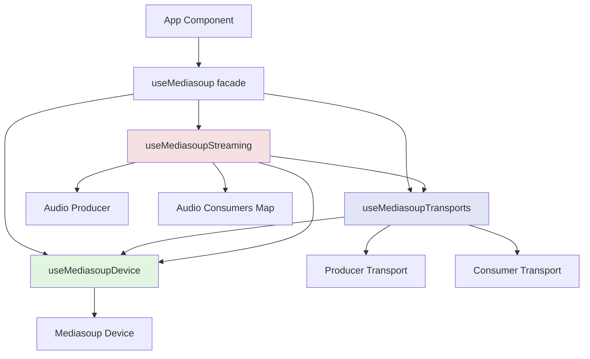
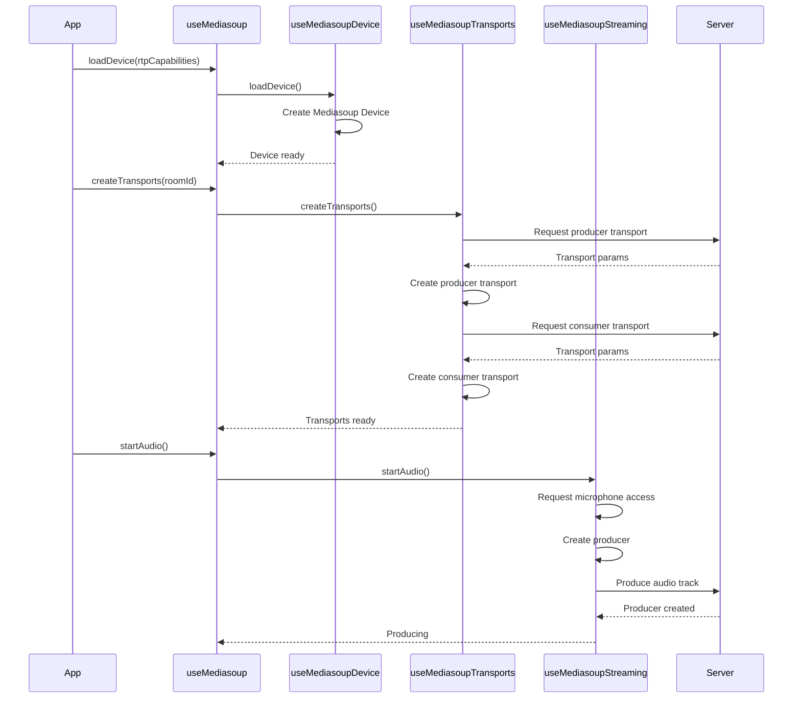

# Mediasoup Architecture

This directory contains three specialized composables that handle WebRTC audio functionality using the Mediasoup library.

## Overview

The Mediasoup integration is split into three focused composables:

1. **`useMediasoupDevice.ts`** - Device initialization
2. **`useMediasoupTransports.ts`** - Transport creation and management
3. **`useMediasoupStreaming.ts`** - Audio production and consumption

These are combined by `useMediasoup.ts` which serves as a backward-compatible facade.

---

## Architecture Diagram



---

## Sequence Diagram: Joining a Room



---

## Module-Level State (Singleton Pattern)

All three composables use **module-level state** to ensure the same Mediasoup instance is shared across all components.

### Why Singleton?

- **WebRTC limitation**: Only one Device instance per browser tab
- **Performance**: Avoid recreating transports
- **State consistency**: All components see the same audio state

### Example

```typescript
// Module-level state (shared across app)
const device = ref<Device | null>(null);
const producer = ref<Producer | null>(null);
const consumers = ref<Map<string, Consumer>>(new Map());
```

⚠️ **Important**: Do NOT call `cleanup()` in `onUnmounted`. This would break other components using the same Mediasoup instance.

---

## Component Responsibilities

### 1. `useMediasoupDevice.ts`

**Purpose**: Manage the Mediasoup Device lifecycle

**Key Methods**:
- `loadDevice(rtpCapabilities)` - Initialize device with server capabilities
- `resetDevice()` - Clear device on cleanup

**State**:
- `device` - Mediasoup Device instance
- `isDeviceLoaded` - Whether device is ready

**When to use**: Call `loadDevice()` once after joining a room.

---

### 2. `useMediasoupTransports.ts`

**Purpose**: Create and manage WebRTC transports

**Key Methods**:
- `createTransports(roomId)` - Create producer and consumer transports
- `createProducerTransport()` - Create transport for sending audio (called on-demand)
- `cleanup()` - Close all transports

**State**:
- `producerTransport` - Send audio to server
- `consumerTransport` - Receive audio from server

**Dependencies**: Requires `useMediasoupDevice` to be loaded first.

---

### 3. `useMediasoupStreaming.ts`

**Purpose**: Handle audio production (mic) and consumption (remote speakers)

**Key Methods**:
- `startAudio()` - Start sending microphone audio
- `stopAudio()` - Stop sending audio
- `toggleLocalMute()` - Mute/unmute microphone locally
- `consumeProducer(producerId, roomId)` - Listen to a remote speaker
- `stopConsumer(producerId)` - Stop listening to a speaker
- `cleanup()` - Close all producers and consumers

**State**:
- `producer` - Local audio producer
- `consumers` - Map of remote audio consumers
- `isProducing` - Whether currently sending audio
- `isLocalMuted` - Whether mic is muted

**Dependencies**: Requires both `useMediasoupDevice` and `useMediasoupTransports`.

---

## Common Workflows

### Starting to Speak

```typescript
const { startAudio, stopAudio, isProducing } = useMediasoup(socket);

// User clicks "Take Seat"
await startAudio();

// User leaves seat
stopAudio();
```

### Listening to Remote Speaker

```typescript
const { consumeProducer } = useMediasoup(socket);

// Server notifies of new producer
socket.on('audio:newProducer', (event) => {
  await consumeProducer(event.producerId, roomId);
});
```

### Cleanup on Room Leave

```typescript
const { cleanup } = useMediasoup(socket);

// When leaving room
cleanup(); // Closes all transports, producers, consumers, and resets device
```

---

## Troubleshooting

### "Device not supported" error

**Cause**: Browser doesn't support WebRTC H264 codec  
**Solution**: Prompt user to use Chrome, Firefox, or Safari

### Autoplay blocked

**Cause**: Browser autoplay policy prevents audio playback  
**Solution**: Already handled in `useMediasoupStreaming` - waits for user interaction

### "Device not loaded" error

**Cause**: Trying to create transports before calling `loadDevice()`  
**Solution**: Always call methods in order:
1. `loadDevice()`
2. `createTransports()`
3. `startAudio()` / `consumeProducer()`

---

## Design Patterns Used

1. **Facade Pattern**: `useMediasoup.ts` hides complexity of 3 composables
2. **Singleton Pattern**: Module-level state ensures one Mediasoup instance
3. **Dependency Injection**: Composables call each other via function composition
4. **Observer Pattern**: WebRTC events trigger Vue reactivity

---

## Future Improvements

- [ ] Add video support (camera streaming)
- [ ] Implement spatial audio (3D positioning)
- [ ] Add bandwidth management (adaptive bitrate)
- [ ] Support screen sharing

---

## Related Files

- `app/composables/useAudioSocket.ts` - Socket.IO connection
- `app/composables/useRoomAudio.ts` - High-level orchestrator
- `app/types/audio.ts` - TypeScript interfaces
