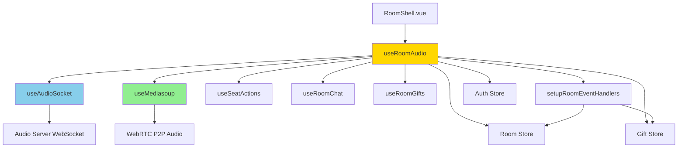
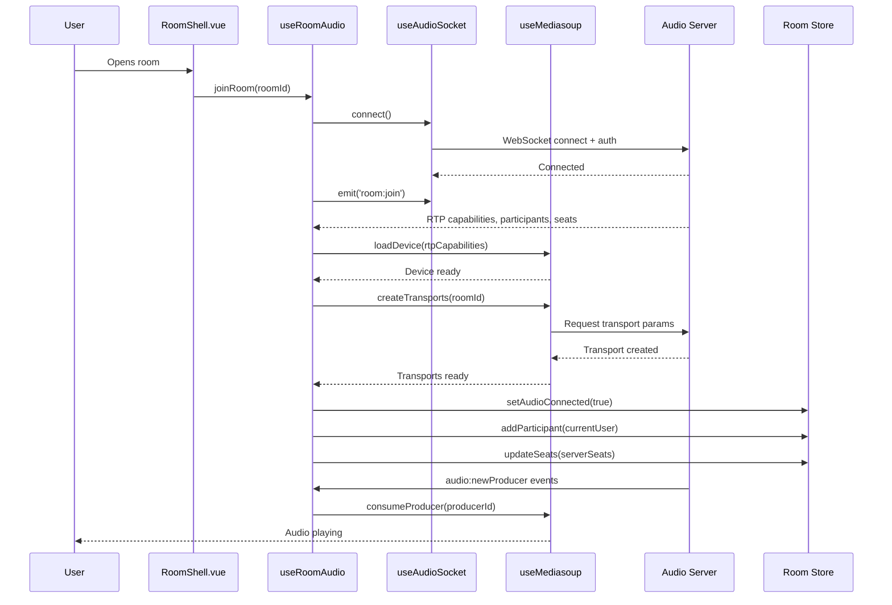
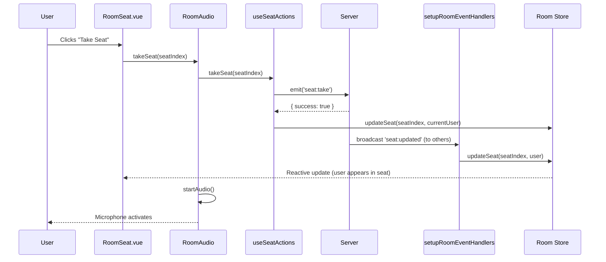
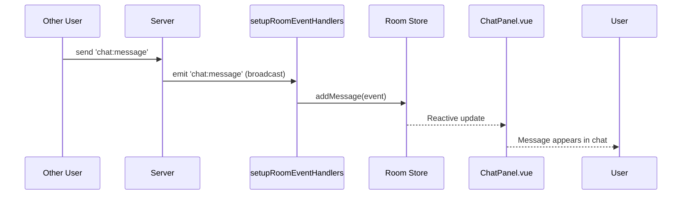

# Room Audio System Architecture

This document explains how the room audio system works and how different composables interact.

## System Overview

The room audio system coordinates WebSocket communication, WebRTC media streaming, and Pinia state management to provide real-time voice chat.

---

## Component Hierarchy



---

## Data Flow: Joining a Room



---

## Composable Responsibilities

### 1. `useRoomAudio` (Orchestrator)

**Role**: High-level coordinator for all room audio functionality

**Responsibilities**:
- Join/leave room lifecycle
- Coordinate socket + mediasoup + stores
- Delegate to specialized composables
- Manage room state transitions

**Key Methods**:
- `joinRoom(roomId)` - Connect and set up everything
- `leaveRoom()` - Clean up all resources
- `start Audio()` - Begin microphone streaming
- `stopAudio()` - Stop microphone streaming

---

### 2. `useAudioSocket` (Communication)

**Role**: WebSocket connection to audio server

**Responsibilities**:
- Establish Socket.IO connection with auth
- Handle reconnection logic
- Provide typed socket interface
- Manage connection status

**Module-Level State**: Singleton socket instance

---

### 3. `useMediasoup` (Media Streaming)

**Role**: WebRTC audio transmission

**Responsibilities**:
- Initialize Mediasoup device
- Create WebRTC transports
- Produce local audio (microphone)
- Consume remote audio (speakers)

**Module-Level State**: Shared device, transports, producers, consumers

**Sub-Composables**:
- `useMediasoupDevice` - Device initialization
- `useMediasoupTransports` - Transport creation
- `useMediasoupStreaming` - Audio production/consumption

---

### 4. `useSeatActions` (Room Permissions)

**Role**: Seat management (who can speak)

**Responsibilities**:
- Take/leave seat
- Assign/remove users (owner only)
- Mute/unmute (owner only)
- Lock/unlock seats (owner only)
- Invite users to seats

**Delegation**: Called by `useRoomAudio`

---

### 5. `useRoomChat` (Messaging)

**Role**: Text chat in rooms

**Responsibilities**:
- Send chat messages via socket
- Format message payloads

**Delegation**: Called by `useRoomAudio`

---

### 6. `useRoomGifts` (Virtual Gifts)

**Role**: Send gift animations

**Responsibilities**:
- Send gift via socket
- Send gift preparation signal (preload)

**Delegation**: Called by `useRoomAudio`

---

### 7. `setupRoomEventHandlers` (Event Listeners)

**Role**: Register socket event handlers

**Responsibilities**:
- Listen to room events (user join/leave, room closed)
- Listen to audio events (new producer, active speaker)
- Listen to seat events (updated, cleared, muted, locked, invited)
- Listen to chat events (messages)
- Listen to gift events (received, error, prepare)
- Update stores reactively

**Delegation**: Called once during `joinRoom()`

---

## State Management

### Room Store (Pinia)

**Purpose**: Centralized room state

**Key State**:
- `currentRoom` - Active room object
- `seats` - Array of 15 seat objects
- `participants` - Map of users in room
- `messages` - Chat message history
- `audioState` - Connection status, producing, muted

**Why Pinia?**:
- Persists `currentRoom` across page refreshes
- Reactive updates trigger UI changes
- Centralized source of truth

---

## Event Flow Examples

### User Takes a Seat



### Receiving a Chat Message



---

## Best Practices

### 1. Always Call Cleanup

```typescript
onUnmounted(() => {
  if (roomStore.currentRoom) {
    leaveRoom(); // Closes socket, transports, resets state
  }
});
```

### 2. Check Connection Status Before Actions

```typescript
const { isConnected, isAudioReady } = useRoomAudio();

if (!isAudioReady.value) {
  toast.add({ title: 'Please wait, connecting...', color: 'warning' });
  return;
}
```

### 3. Handle Errors Gracefully

```typescript
try {
  await joinRoom(roomId);
} catch (error) {
  toast.add({ title: 'Failed to join', description: error.message });
  // Don't close room - user can still use chat
}
```

### 4. Use Cached Dependencies

All composables cache dependencies at module level to prevent `inject()` warnings:

```typescript
let _roomStore: ReturnType<typeof useRoomStore> | null = null;

export function useRoomAudio() {
  if (!_roomStore) _roomStore = useRoomStore();
  const roomStore = _roomStore;
  // ...
}
```

---

## Common Issues

| Issue | Cause | Solution |
|-------|-------|----------|
| Socket disconnects | Token expired | Refresh token and reconnect |
| Audio not heard | Consumer not created | Check `audio:newProducer` event handler |
| Double join | Watch fires twice | Use`isJoining` flag to prevent |
| Memory leak | Cleanup not called | Always call `leaveRoom()` on unmount |

---

## Testing Scenarios

### Manual Testing Checklist

- [✓] Join room → Audio connects
- [✓] Take seat → Microphone activates
- [✓] Mute/unmute → Works correctly
- [✓] Send chat → Message appears
- [✓] Send gift → Animation plays
- [✓] Leave room → All resources cleaned up
- [✓] Rejoin room → Works without page refresh
- [✓] Tab loses focus → Reconnects on focus

---

## Architecture Decisions

### Why Not One Giant Composable?

**Before**: `useRoomAudio` was 600+ lines handling everything

**After**: Split into focused composables

**Benefits**:
- Easier to test individual pieces
- Clearer responsibilities
- Easier to extend (e.g., add video later)
- Better code reuse

### Why Module-Level State?

WebRTC Device is a browser singleton - having multiple instances causes conflicts. Module-level state ensures one shared instance across all components.

### Why Pinia for Room State?

Composables are stateless functions called on every render. Pinia provides:
- Persistent reactive state
- DevTools integration
- Type safety
- Automatic serialization

---

## Future Enhancements

- [ ] Add video streaming support
- [ ] Implement hand raise feature
- [ ] Add recording functionality
- [ ] Support breakout rooms
- [ ] Add noise suppression toggle

---

## Related Documentation

- [Mediasoup README](./mediasoup/README.md) - WebRTC implementation details
- [Socket.IO Events](../types/audio.ts) - Event type definitions
- [Room Store API](../stores/room.ts) - State management reference
