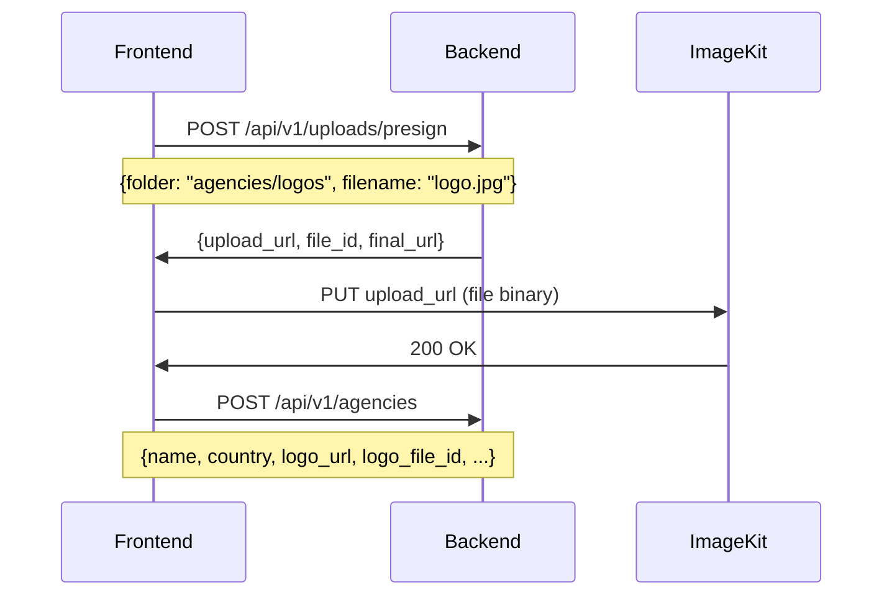

# Agency Creation - Backend Requirements

> **Date**: 2025-12-28  
> **Priority**: CRITICAL (Blocking Feature)
> **Frontend Status**: Implementation Complete, Blocked on Backend

---

## Current Issues

### 1. CORS Error (CRITICAL)
```
Access to fetch at 'http://localhost:8000/api/v1/agencies' from origin 'http://localhost:3000' 
has been blocked by CORS policy: No 'Access-Control-Allow-Origin' header is present
```

**Fix Required**: Add `http://localhost:3000` to allowed CORS origins for development.

### 2. Request Timeout
Large file uploads timeout (408 error) even with 60s client timeout.

---

## Recommended Approach: Pre-Signed Upload URLs

This is the **industry standard** for file uploads and solves all issues:



### Benefits
- ✅ No CORS issues (direct upload to ImageKit CDN)
- ✅ No timeout issues (upload is separate from API call)
- ✅ Progress feedback (can show upload %)
- ✅ Resume capability (failed uploads can retry)
- ✅ Smaller API payloads (only URLs, not file data)
- ✅ Better error handling (know exactly which file failed)

---

## Required Backend Endpoints

### 1. Pre-Signed Upload URL Generator

```http
POST /api/v1/uploads/presign
Authorization: Bearer {token}
Content-Type: application/json

{
  "folder": "agencies/logos" | "agencies/national-ids",
  "filename": "original-filename.jpg",
  "content_type": "image/jpeg"
}
```

**Response:**
```json
{
  "upload_url": "https://upload.imagekit.io/...",
  "file_id": "ik_xxxxx",
  "final_url": "https://ik.imagekit.io/flylive/agencies/logos/xxxxx.jpg",
  "expires_at": "2025-12-28T01:00:00Z"
}
```

**Validation:**
- User must be authenticated
- `folder` must be in allowed list
- `content_type` must be image/*
- Rate limit: 10 requests per minute per user

---

### 2. Updated Agency Creation (URL-Based)

```http
POST /api/v1/agencies
Authorization: Bearer {token}
Content-Type: application/json

{
  "name": "Test Agency",
  "country": "PK",
  "address": "123 Main Street",
  "logo_url": "https://ik.imagekit.io/flylive/agencies/logos/xxxxx.jpg",
  "logo_file_id": "ik_xxxxx",
  "national_id_images": [
    {
      "url": "https://ik.imagekit.io/flylive/agencies/national-ids/front.jpg",
      "file_id": "ik_yyyyy",
      "side": "front"
    },
    {
      "url": "https://ik.imagekit.io/flylive/agencies/national-ids/back.jpg",
      "file_id": "ik_zzzzz",
      "side": "back"
    }
  ],
  "coin_reseller_id": 123
}
```

---

## Alternative: Fix Current Implementation

If pre-signed URLs are too much work, fix these issues:

### 1. Add CORS Headers
```php
// In Laravel CORS config
'allowed_origins' => ['http://localhost:3000', 'https://app.flylive.app'],
'allowed_methods' => ['GET', 'POST', 'PUT', 'PATCH', 'DELETE', 'OPTIONS'],
'allowed_headers' => ['Content-Type', 'Authorization', 'X-Requested-With', 'Accept'],
```

### 2. Increase Upload Limits
```php
// In php.ini or nginx config
upload_max_filesize = 10M
post_max_size = 20M
max_execution_time = 120
```

### 3. Add Request Timeout Headers
```php
// In response headers
'Access-Control-Max-Age' => 3600
```

---

## Frontend Implementation Status

| Component | Status |
|-----------|--------|
| Form validation | ✅ Complete |
| File upload UI | ✅ Complete |
| API integration | ✅ Complete (waiting for CORS fix) |
| Error handling | ✅ Complete |
| Timeout handling | ✅ Complete (60s timeout) |

---

## Immediate Action Needed

1. **CORS**: Add `localhost:3000` to allowed origins
2. **Timeout**: Increase PHP/nginx timeout for this endpoint
3. **Choose approach**: Pre-signed URLs (recommended) or direct multipart

Please confirm which approach you'll implement and the estimated timeline.
