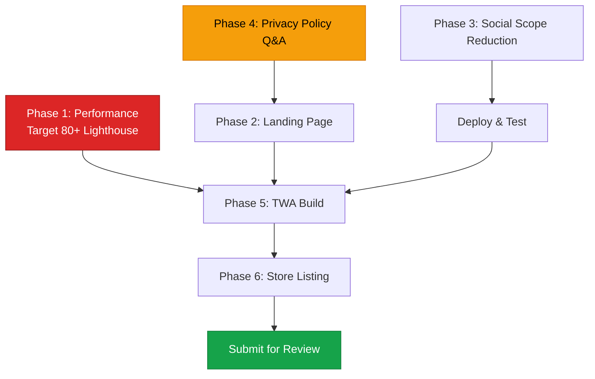

# Google Play Store Readiness Plan — FlyLive PWA (v2)

> Updated with your answers and additional research findings.
> 

---

## 🚨 Critical Discovery: Lighthouse 80+ Is MANDATORY

> [!CAUTION]
**TWA apps require a minimum Lighthouse performance score of 80/100 to be accepted on Google Play.** Your current score is **41/100**. This is not a soft guideline — it's an enforced requirement. The TWA will literally show a browser URL bar (breaking the native app illusion) if your performance drops below threshold, and Google may reject the listing outright.
> 
> 
> Source: [Chromium Blog TWA Requirements](https://firt.dev/pwa-playstore/), [Stack Overflow confirmation](https://stackoverflow.com/questions/64452093/is-80-a-strict-lighthouse-scores-for-publishing-twa-apps), [MobileLoud 2026](https://www.mobiloud.com/blog/publishing-pwa-app-store)
> 

---

## Resolved Questions

| Question | Answer | Impact |
| --- | --- | --- |
| Play Developer Account | ✅ Registered and paid | No blocker |
| Package ID | `com.flyliveapp.app` recommended (mirrors domain, clean, not tied to TWA implementation) | Set once, permanent |
| Privacy Policy | Separate workstream — Q&A-driven generation | Phase 4 |
| Age Rating | 18+ only, social media (TikTok-live style), no nudity/explicit content allowed, permanent ban policy | IARC: Social → Mature 17+ |
| Facebook scopes | Keep minimal (email + public_profile only) — already confirmed, no changes needed | ✅ Already correct |
| Google scopes | Remove sensitive scopes (birthday, gender, phone) — collect in-app instead | Phase 3 |
| Scrolling cards | Keep — optimize around them | Phase 1 |
| Landing page | **YES, required** — see below | Phase 2 |

---

## Landing Page — You ARE Correct, It IS Required

You need a public landing page for **three separate reasons**:

### 1. Google OAuth Consent Screen Verification

> Google's OAuth consent screen verification process requires **verification of all domains associated with your project's home page, privacy policy, and terms of service**. If a Google reviewer clicks your home page link and sees a "Sign In" screen with no info, **they can't verify your intent** and will reject the verification.
> 
> 
> — [Google OAuth Policy Compliance](https://developers.google.com/identity/protocols/oauth2/production-readiness/policy-compliance)
> 

### 2. Google Play Store Listing

The Play Store requires a "website" URL for your app. Sending reviewers to a login wall is a bad signal.

### 3. TWA Digital Asset Links

The domain hosting the TWA must be publicly accessible and have the `assetlinks.json` file. A landing page gives context to anyone who visits the raw domain.

**What the landing page needs:**

- App description and key features (no login required to view)
- Download/install CTA (links to Play Store listing once published)
- Links to Privacy Policy and Terms of Service
- Screenshots/previews of the app experience
- Contact information
- **Must be at a public route** like `/` or `/welcome` — NOT behind auth middleware

---

## Which Pages Need Performance Optimization?

> [!IMPORTANT]
**Short answer: Only the `start_url` page is tested by Lighthouse for the TWA score.** But in practice, optimize the critical user path.
> 

### Must optimize (tested by TWA / reviewers):

1. **`/` (start_url = `/?fullscreen=true`)** — This is what Lighthouse scores. Currently your home page is behind auth middleware, so unauthenticated users get redirected to login. **This means the login page IS the effective start_url for first-time users and reviewers.**
2. **`/log-in`** — The page you Lighthouse-tested. Score: 41. Must reach 80+.

### Should optimize (reviewer experience):

1. **Home page** (`/(home)/index.vue`) — Once logged in, this is the first experience
2. **Sign-up** and **complete-profile-data** — Reviewer flow

### Not critical for approval:

- Deep feature pages (room, wallet, VIP, mall, etc.) — reviewers won't dig this deep initially

---

## Proposed Changes — 6 Phases

### Phase 1: Performance Optimization (MANDATORY — Target: 80+ Lighthouse)

Your current bottlenecks on the login page:

| Problem | Cause | Fix |
| --- | --- | --- |
| **LCP 8.2s** | Hero background image (`profile-bg.jpeg` via ImageKit) loads full-size, no transforms | Add ImageKit URL transforms for mobile widths |
| **LCP 8.2s** | 6 auth card images (`1-6.webp`) load eagerly at full resolution | Add ImageKit transforms + lazy loading for cards |
| **FCP 3.0s** | SPA cold boot — entire JS bundle must parse before first paint | Add app loading screen in `index.html` |
| **TBI 860ms** | Large JS bundle blocking main thread | Already chunked, but auth page may import heavy deps |
| **Speed Index 11.2s** | Combined effect of all above | Cascading improvement from fixing LCP + FCP |

### 1a. ImageKit URL Transforms

ImageKit supports [URL-based transforms](https://docs.imagekit.io/features/image-transformations). Since your images are already on ImageKit CDN, you just need to add transform parameters to the URLs.

**For auth card images** (currently loaded at full size):

```tsx
// Before: loads full original image
AUTH_CARD_1: `${IK}/placeholders/1.webp`

// After: mobile-optimized (250px width, auto quality, WebP)
AUTH_CARD_1: `${IK}/placeholders/1.webp?tr=w-250,q-70,f-webp`
```

**For the hero background** (the biggest LCP offender):

```tsx
// Before: full-size JPEG
COVER_PLACEHOLDER: `${IK}/placeholders/profile-bg.jpeg`

// After: mobile viewport width, aggressive quality, blur for decorative use
COVER_PLACEHOLDER: `${IK}/placeholders/profile-bg.jpeg?tr=w-420,q-60,f-webp,bl-3`
```

**Alternative — use `<NuxtImg>` with ImageKit provider:**

Your `dummy-room-card.vue` already uses `<NuxtImg>` with `width="250"` and `format="webp"` — but without an ImageKit provider configured, Nuxt Image can't generate transform URLs. You have two options:

**Option A (Quick — URL transforms in constants):** Add `?tr=` params directly to the asset URLs in `assets.ts`. Fast, no config changes.

**Option B (Proper — Nuxt Image ImageKit provider):** Configure the ImageKit provider in `nuxt.config.ts`:

```tsx
image: {
  imagekit: {
    baseURL: '<https://ik.imagekit.io/flylive>'
  }
}
```

Then `<NuxtImg>` automatically generates optimized URLs with `width`, `quality`, `format` props.

> [!TIP]
**Recommendation: Option A first** for the auth page (fastest fix), then Option B for the whole app later.
> 

### 1b. App Loading Screen (Fixes FCP)

Since this is an SPA (`ssr: false`), there's nothing visible until the entire Vue app hydrates. Add an inline loading screen directly in the HTML shell that shows immediately and disappears when Vue mounts.

### [NEW] `app/app.vue` or `index.html` modification

- Add an inline `<div id="app-loader">` with your logo and a CSS spinner
- Pure CSS + inline SVG — zero JS dependency
- Remove it in `app.vue`'s `onMounted`
- This alone can drop FCP from 3.0s to ~0.5s

### 1c. Lazy-Load Auth Card Images

### [MODIFY] [dummy-room-card.vue](file:///home/xha/Flylive/frontend-nuxt-4-active/app/components/auth/dummy-room-card.vue)

- Add `loading="lazy"` to the `<NuxtImg>` component
- Add `fetchpriority="low"` since these are decorative

### 1d. Lazy-Load Hero Background

### [MODIFY] [auth.vue](file:///home/xha/Flylive/frontend-nuxt-4-active/app/layouts/auth.vue)

- The hero `<NuxtImg>` on line 33 loads `COVER_PLACEHOLDER` — add `loading="lazy"` and `fetchpriority="low"`
- Better: Use a CSS background gradient as the initial paint, then swap to the image via `onMounted`

### 1e. Preload Critical Font

If using a custom font (Google Fonts like Inter), add a `<link rel="preload">` for the WOFF2 file.

---

### Phase 2: Landing Page

### [NEW] `app/pages/welcome.vue`

A public-facing landing page (no auth middleware) that includes:

- App logo and tagline
- Feature highlights (live audio rooms, gifts, VIP, social)
- App screenshots carousel
- "Open App" / "Get on Google Play" CTA buttons
- Footer with links to Privacy Policy and Terms of Service
- Contact/support email

### [MODIFY] Auth middleware or `start_url`

Two options for handling the start_url:

- **Option A**: Change `start_url` to `/welcome` in the manifest — new users see the landing page first
- **Option B**: Keep `start_url` as `/` but add the `/welcome` page separately — use it as your OAuth consent screen homepage URL and Play Store website

> [!IMPORTANT]
**Recommendation: Option B.** Keep the existing auth flow untouched. The landing page is a separate public page used for:
> 
> 1. Google OAuth consent screen "Application home page" URL → `https://flyliveapp.com/welcome`
> 2. Google Play Store "website" field → `https://flyliveapp.com/welcome`
> 3. Linked from Privacy Policy and Terms pages

---

### Phase 3: Social Login Scope Reduction

### [MODIFY] [SocialAuthProvider.php](file:///home/xha/Flylive/backend/app/Enums/SocialAuthProvider.php#L28-L49)

```diff
 public function scopes(): array
 {
     return match ($this) {
         self::Google => [
             'openid',
             'profile',
             'email',
-            '<https://www.googleapis.com/auth/user.birthday.read>',
-            '<https://www.googleapis.com/auth/user.gender.read>',
-            '<https://www.googleapis.com/auth/user.phonenumbers.read>',
         ],
         self::Facebook => [
             'email',
             'public_profile',
         ],
         self::Apple => [
             'name',
             'email',
         ],
     };
 }
```

### [MODIFY] `driverOptions()` in same file

```diff
 public function driverOptions(): array
 {
     return match ($this) {
-        self::Google => ['access_type' => 'offline'],
+        self::Google => [], // No need for refresh_token without People API
         self::Facebook => [],
         self::Apple => [],
     };
 }
```

### [MODIFY] `extractExtendedData()` in same file

- Comment out the Google People API calls (keep the code for potential future use)
- Return empty array for Google, same as Apple

**No frontend changes needed** — the frontend doesn't know about scopes; it just calls the redirect endpoint.

---

### Phase 4: Privacy Policy & Terms (Separate Workstream)

> [!NOTE]
As you requested, this will be a separate Q&A-driven workstream. I'll guide you through generating proper legal documents. Here's what we'll cover:
> 

**Privacy Policy Q&A Topics:**

1. Company/entity legal name and jurisdiction
2. Complete data inventory (what you collect, store, process)
3. Third-party services and data sharing
4. Data retention periods
5. User rights (access, deletion, portability)
6. Cookie/tracking usage
7. Children's policy (COPPA — you're 18+ so this is straightforward)
8. International data transfers
9. Contact information for data inquiries

**Approach options:**

- **Manual (recommended for your case):** I'll generate the full text based on your Q&A answers, tailored specifically to FlyLive's data practices. More control, more accurate.
- **Online generators (e.g., Termly, [PrivacyPolicies.com](http://privacypolicies.com/)):** Faster but generic. May miss your virtual currency/gift economy specifics.

**I recommend manual** since your app has unique elements (virtual currency economy, gift system, audio rooms, VIP memberships) that generic generators won't cover properly.

---

### Phase 5: TWA Packaging & Asset Links

### [NEW] `public/.well-known/assetlinks.json`

After you have your upload keystore:

```json
[{
  "relation": ["delegate_permission/common.handle_all_urls"],
  "target": {
    "namespace": "android_app",
    "package_name": "com.flyliveapp.app",
    "sha256_cert_fingerprints": ["<YOUR_SHA256_FINGERPRINT>"]
  }
}]
```

**Cloudflare Pages note:** Cloudflare serves files from `public/.well-known/` correctly. Verify after deploy:

```bash
curl -I <https://flyliveapp.com/.well-known/assetlinks.json>
# Must return: Content-Type: application/json
```

### TWA Generation

```bash
# Install Bubblewrap
npm i -g @nicolo-ribaudo/bubblewrap

# Initialize from your manifest
bubblewrap init --manifest <https://flyliveapp.com/manifest.webmanifest>

# Build the AAB (Android App Bundle)
bubblewrap build
```

This generates a signed `.aab` file ready for upload to Google Play Console.

---

### Phase 6: Store Listing Preparation

| Asset | Spec | Status |
| --- | --- | --- |
| **App Icon** | 512×512 PNG, no transparency, 32-bit color | Need to export from existing logo |
| **Feature Graphic** | 1024×500 PNG/JPG | ❌ Need to create |
| **Phone Screenshots** | 1080×1920 (min 4, max 8) | ❌ Need 4-8 captures |
| **Short Description** | Max 80 chars | Draft: "Live audio rooms with gifts, VIP, and social features — stream on FlyLive" |
| **Full Description** | Max 4000 chars | ❌ Need to write |
| **Demo Account** | Full-featured test account for reviewers | ❌ Need to create |
| **Content Rating** | IARC questionnaire | ❌ Fill in Play Console |
| **Data Safety Form** | Declare all data practices | ❌ Fill in Play Console |
| **Target API Level** | API 34+ (Android 14) recommended | Set in Bubblewrap config |

---

## Execution Order & Dependencies



**Parallel tracks:**

- **Track A** (Code): Phase 1 (Performance) + Phase 2 (Landing Page) + Phase 3 (Scopes) → can start immediately
- **Track B** (Legal): Phase 4 (Privacy Policy Q&A) → separate sessions, can run in parallel
- **Track C** (Packaging): Phase 5 + 6 → depends on Phase 1 achieving 80+ score

---

## Package ID Recommendation

For your domain `flyliveapp.com`, the convention is to reverse the domain:

| Option | Format | Notes |
| --- | --- | --- |
| `com.flyliveapp.app` | ✅ **Recommended** | Clean, professional, not tied to TWA implementation |
| `com.flyliveapp.twa` | ❌ Avoid | Exposes implementation detail in package name |
| `com.flyliveapp.android` | ⚠️ OK | Unnecessarily specific |

**Go with `com.flyliveapp.app`** — it's clean, permanent, and works even if you later migrate from TWA to a native wrapper.

# Google Play Store Readiness — Task List

## Phase 1: Performance Optimization (Target: 80+ Lighthouse)

- [x]  1a. Add ImageKit URL transforms to auth card images in `assets.ts`
- [x]  1b. Add ImageKit URL transforms to hero background in `assets.ts`
- [x]  1c. Add inline SPA loading screen (`spa-loading-template.html`)
- [x]  1d. Add `loading="lazy"` + `fetchpriority="low"` to `dummy-room-card.vue` NuxtImg
- [x]  1e. Add `loading="lazy"` + `fetchpriority="low"` to hero image in `auth.vue`
- [x]  1f. Configure Nuxt Image ImageKit provider in `nuxt.config.ts`
- [x]  1g. Fix SPA loading template — use small logo (26KB vs 181KB)
- [x]  1h. **Convert /welcome to pure static HTML** — bypasses entire SPA JS bundle
- [x]  1i. Convert /privacy-policy to pure static HTML
- [x]  1j. Convert /terms-of-service to pure static HTML
- [x]  1k. Fix auth middleware — use `external: true` for /welcome redirect
- [ ]  1l. Deploy and run Lighthouse — verify score ≥ 80

## Phase 2: Landing Page

- [x]  Create static `public/welcome/index.html` (pure HTML/CSS, zero JS)
- [x]  Create static `public/privacy-policy/index.html`
- [x]  Create static `public/terms-of-service/index.html`
- [x]  Add consent text + legal links to `sign-up.vue`
- [x]  Remove Vue-based `welcome.vue`, `privacy-policy.vue`, `terms-of-service.vue`
- [ ]  Verify pages are accessible without login (needs deploy)

## Phase 3: Social Login Scope Reduction

- [x]  Remove sensitive Google scopes from `SocialAuthProvider.php`
- [x]  Remove `access_type: offline` driver option
- [x]  Disable Google People API calls in `extractExtendedData()`

## Phase 4: Privacy Policy & Terms (Separate Workstream)

- [ ]  Q&A session with user
- [ ]  Generate full privacy policy content
- [ ]  Generate full terms of service content
- [ ]  Update static HTML pages with final content

## Phase 5: TWA Packaging & Asset Links

- [x]  Create `public/.well-known/assetlinks.json` (placeholder — SHA256 fingerprint TBD)
- [ ]  Deploy and verify asset links accessible at `https://flyliveapp.com/.well-known/assetlinks.json`
- [ ]  Generate signing keystore
- [ ]  Update assetlinks.json with real SHA256 fingerprint
- [ ]  Build TWA with Bubblewrap
- [ ]  Test on Android device

## Phase 6: Store Listing

- [ ]  Export 512×512 app icon (PNG, no transparency)
- [ ]  Create 1024×500 feature graphic
- [ ]  Capture 4-8 phone screenshots (1080×1920)
- [ ]  Write short description (80 chars)
- [ ]  Write full description (4000 chars)
- [ ]  Create demo/reviewer test account
- [ ]  Complete IARC content rating questionnaire
- [ ]  Complete Data Safety form
- [ ]  Submit for review