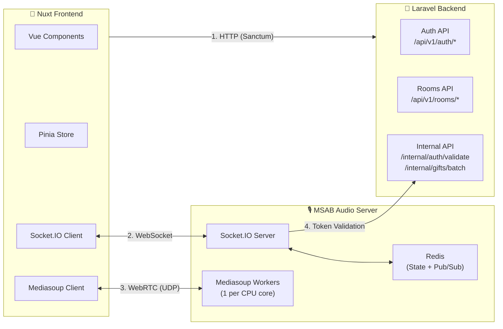
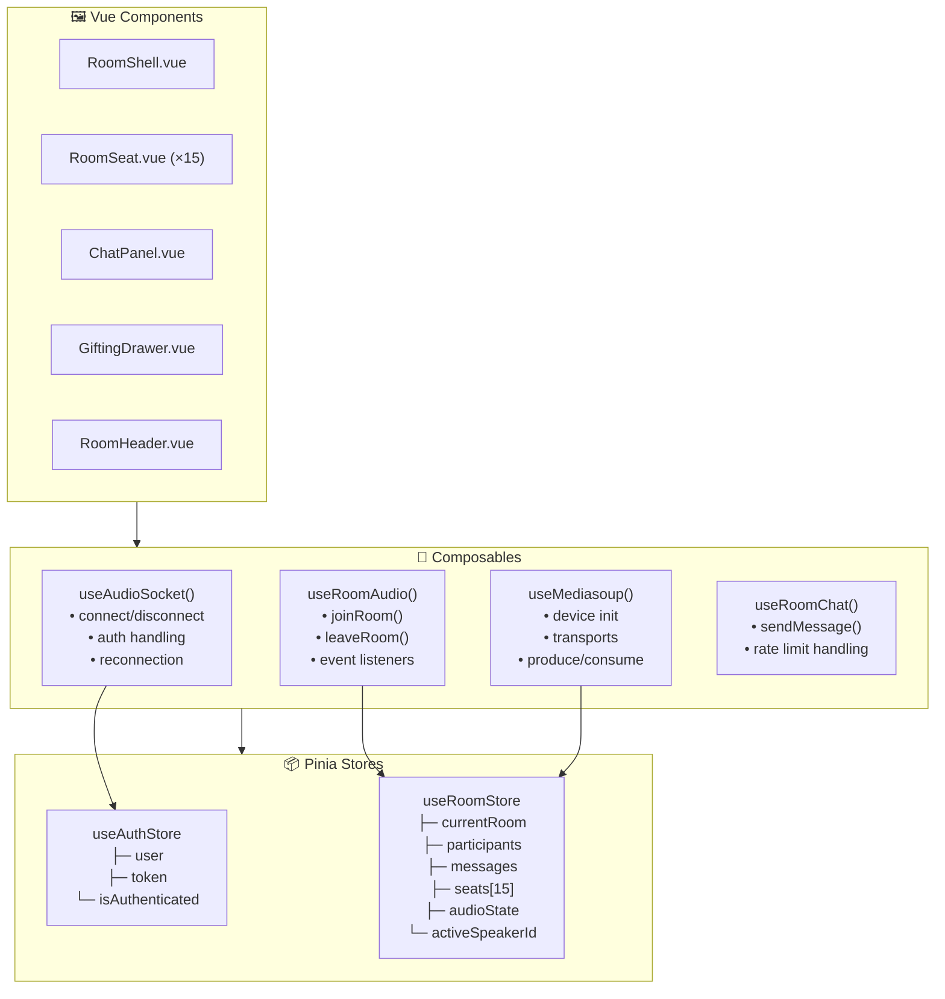
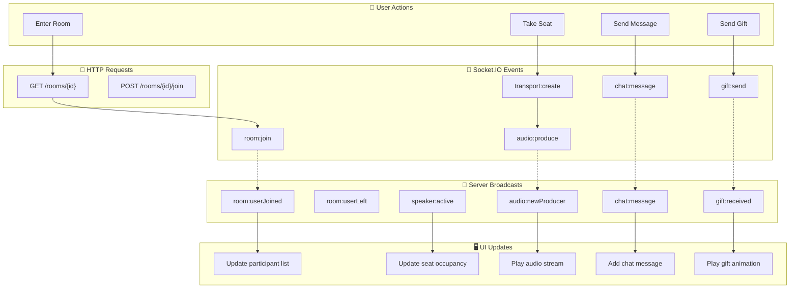
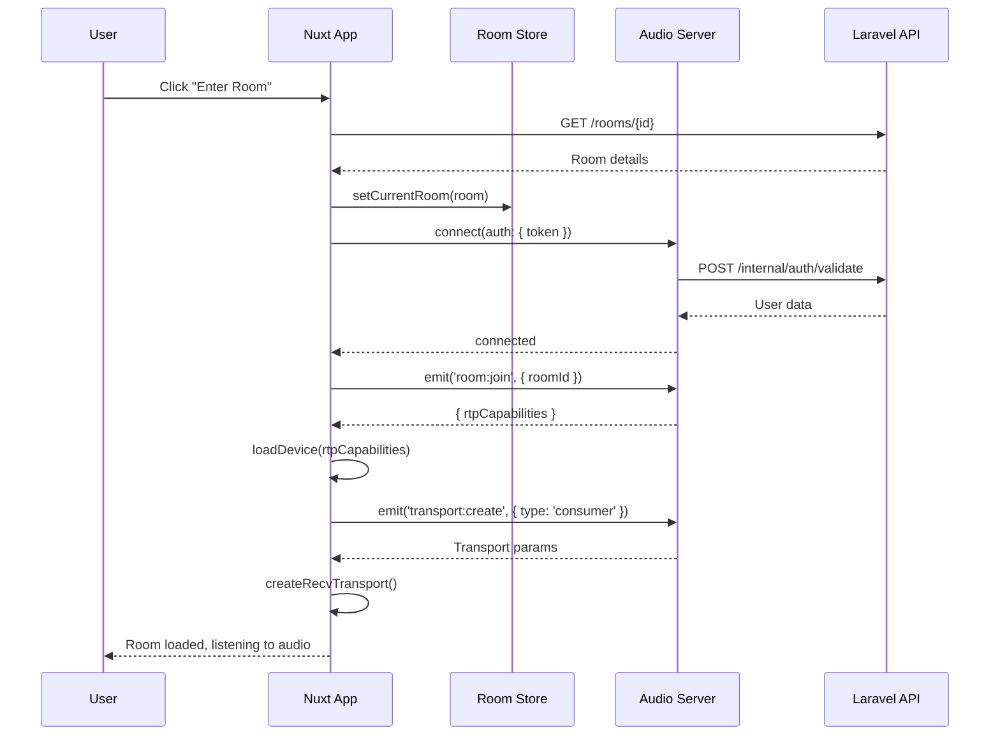
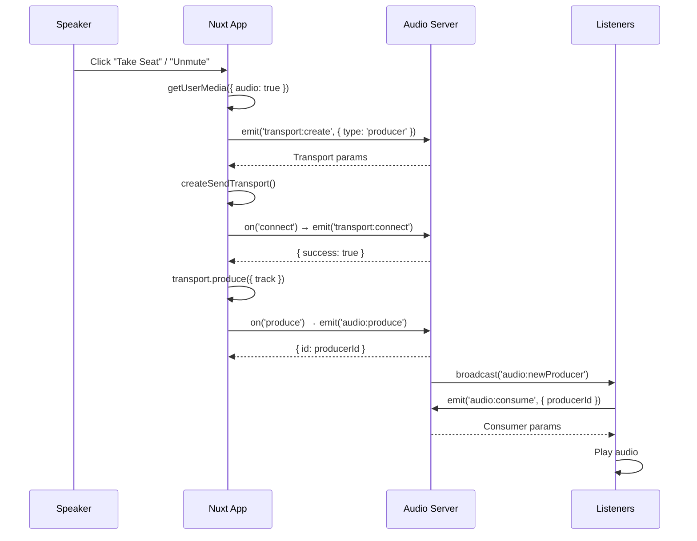
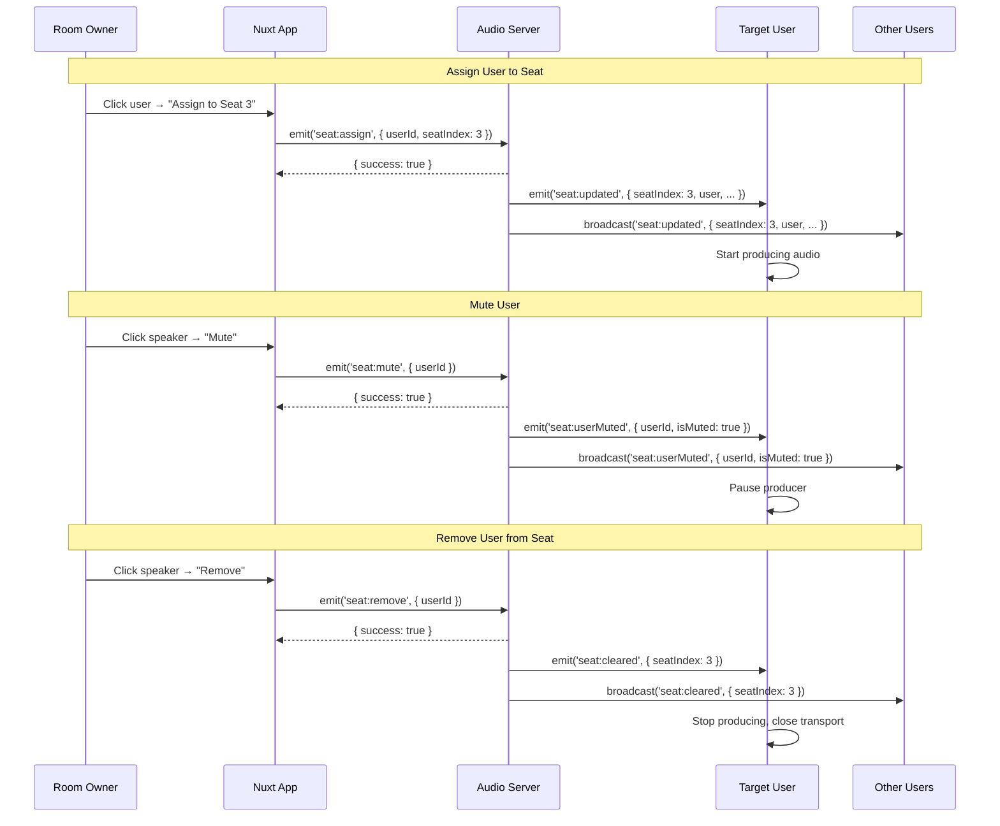

# Rooms + Realtime Messages + Audio Broadcasting Implementation Plan

> **Executive Summary**: This plan integrates real-time audio broadcasting capabilities into the existing FlyLive application by connecting the Nuxt frontend to the existing MSAB (Mediasoup Socket.IO Audio Broadcasting) server. The implementation leverages existing Laravel authentication, room management APIs, and Nuxt UI components while adding Socket.IO for signaling and mediasoup-client for WebRTC audio. The design prioritizes minimal state duplication, modular composables, and progressive enhancement of existing components.

---

## Architecture Overview

### 1. System Architecture (High-Level)



---

### 2. Frontend Layer Architecture



---

### 3. Data Flow Architecture



---

## Confirmed Design Decisions

> [!NOTE]
> **User-confirmed requirements:**

| Decision | Confirmed Approach |
|----------|-------------------|
| **Audio Server URL** | Environment variable `NUXT_PUBLIC_AUDIO_SERVER_URL` (no hardcoded URLs) |
| **Seat Assignment** | **Hybrid**: Users can self-select empty seats + Owner can assign/remove/mute users |
| **Chat Persistence** | **Ephemeral** - messages exist only during room session, no Laravel API |

### Seat Management Features

| Action | Who Can Do It | Socket Event |
|--------|---------------|-------------|
| Take empty seat | Any user | `seat:take` |
| Leave seat | Self only | `seat:leave` |
| Assign user to seat | Room owner | `seat:assign` |
| Remove user from seat | Room owner | `seat:remove` |
| Mute user on seat | Room owner | `seat:mute` |
| Unmute user on seat | Room owner | `seat:unmute` |

---

## Proposed Changes

### Core Dependencies

#### [MODIFY] [package.json](file:///wsl.localhost/Ubuntu-24.04/home/stfox/completed-fl/frontend-nuxt-4-active/package.json)

Add required npm packages:
```json
{
  "dependencies": {
    "socket.io-client": "^4.8.1",
    "mediasoup-client": "^3.7.0"
  }
}
```

---

### New Types Module

#### [NEW] [types/audio.ts](file:///wsl.localhost/Ubuntu-24.04/home/stfox/completed-fl/frontend-nuxt-4-active/app/types/audio.ts)

Define Socket.IO event payloads and mediasoup types:

```typescript
// Socket.IO Event Types
export interface JoinRoomPayload { roomId: string }
export interface JoinRoomResponse { rtpCapabilities?: RtpCapabilities; error?: string }

// Transport Types
export interface TransportCreatePayload { type: 'producer' | 'consumer'; roomId: string }
export interface TransportCreateResponse { id: string; iceParameters: IceParameters; /* ... */ }

// Audio Types
export interface AudioProducePayload { roomId: string; transportId: string; kind: 'audio'; rtpParameters: RtpParameters }
export interface NewProducerEvent { producerId: string; userId: number; kind: 'audio' }

// Seat Management Types
export interface SeatTakePayload { roomId: string; seatIndex: number }
export interface SeatLeavePayload { roomId: string }
export interface SeatAssignPayload { roomId: string; userId: number; seatIndex: number }
export interface SeatRemovePayload { roomId: string; userId: number }
export interface SeatMutePayload { roomId: string; userId: number }
export interface SeatUpdatedEvent { seatIndex: number; user: RoomParticipant | null; isMuted: boolean }
export interface SeatClearedEvent { seatIndex: number }
export interface SeatUserMutedEvent { userId: number; isMuted: boolean }

// Chat Types (Ephemeral - no Laravel persistence)
export interface ChatMessage { id: string; userId: number; userName: string; avatar: string; content: string; type: string; timestamp: number }

// Gift Types
export interface GiftReceivedEvent { senderId: number; senderName: string; giftId: string; recipientId: number; quantity: number }

// Room Participant
export interface RoomParticipant { id: number; name: string; avatar_url?: string; role?: string; isSpeaker: boolean; seatIndex?: number; isMuted?: boolean }

// Audio State
export interface AudioState { isConnected: boolean; isProducing: boolean; isMuted: boolean; activeSpeakerId: number | null }
```

---

### Socket Connection Composable

#### [NEW] [composables/useAudioSocket.ts](file:///wsl.localhost/Ubuntu-24.04/home/stfox/completed-fl/frontend-nuxt-4-active/app/composables/useAudioSocket.ts)

Manages Socket.IO connection with auth and reconnection:

```typescript
export function useAudioSocket() {
  const config = useRuntimeConfig()
  const authStore = useAuthStore()
  const socket = ref<Socket | null>(null)
  const isConnected = ref(false)
  const connectionError = ref<string | null>(null)

  // Connect with Sanctum token
  function connect() {
    if (!authStore.token) throw new Error('Authentication required')
    
    socket.value = io(config.public.audioServerUrl, {
      auth: { token: authStore.token },
      reconnection: true,
      reconnectionAttempts: 5,
      transports: ['websocket', 'polling']
    })
    
    // Handle auth errors, trigger token refresh
    socket.value.on('connect_error', handleConnectError)
  }

  // Graceful disconnect
  function disconnect() { socket.value?.disconnect() }

  return { socket, isConnected, connectionError, connect, disconnect }
}
```

---

### Mediasoup Device Composable

#### [NEW] [composables/useMediasoup.ts](file:///wsl.localhost/Ubuntu-24.04/home/stfox/completed-fl/frontend-nuxt-4-active/app/composables/useMediasoup.ts)

Handles WebRTC transports, producers, and consumers:

```typescript
export function useMediasoup(socket: Ref<Socket | null>) {
  const device = ref<Device | null>(null)
  const producerTransport = ref<Transport | null>(null)
  const consumerTransport = ref<Transport | null>(null)
  const producer = ref<Producer | null>(null)
  const consumers = ref<Map<string, Consumer>>(new Map())

  // Initialize device with RTP capabilities from server
  async function loadDevice(rtpCapabilities: RtpCapabilities) {
    device.value = new Device()
    await device.value.load({ routerRtpCapabilities: rtpCapabilities })
  }

  // Create send/receive transports
  async function createTransports(roomId: string) { /* emit transport:create */ }

  // Start producing audio from microphone
  async function startAudio() {
    const stream = await navigator.mediaDevices.getUserMedia({ audio: true })
    producer.value = await producerTransport.value!.produce({ track: stream.getAudioTracks()[0] })
  }

  // Consume audio from another producer
  async function consumeProducer(producerId: string) { /* emit audio:consume + consumer:resume */ }

  return { device, startAudio, stopAudio, consumeProducer, consumers }
}
```

---

### Extended Room Store

#### [MODIFY] [stores/room.ts](file:///wsl.localhost/Ubuntu-24.04/home/stfox/completed-fl/frontend-nuxt-4-active/app/stores/room.ts)

Add audio state, participants, chat messages, and seat management:

```typescript
// Add to existing store:
const participants = ref<Map<number, RoomParticipant>>(new Map())
const audioState = ref<AudioState>({ isConnected: false, isProducing: false, isMuted: false, activeSpeakerId: null })
const messages = ref<ChatMessage[]>([])
const seats = ref<(RoomParticipant | null)[]>(Array(15).fill(null)) // 15 speaker seats

// Actions:
function addParticipant(user: RoomParticipant) { participants.value.set(user.id, user) }
function removeParticipant(userId: number) { participants.value.delete(userId) }
function addMessage(message: ChatMessage) { messages.value.push(message) }
function setSeat(index: number, user: RoomParticipant | null) { seats.value[index] = user }
function setActiveSpeaker(userId: number | null) { audioState.value.activeSpeakerId = userId }
```

---

### Room Audio Integration Composable

#### [NEW] [composables/useRoomAudio.ts](file:///wsl.localhost/Ubuntu-24.04/home/stfox/completed-fl/frontend-nuxt-4-active/app/composables/useRoomAudio.ts)

Orchestrates complete room audio lifecycle:

```typescript
export function useRoomAudio() {
  const roomStore = useRoomStore()
  const { socket, connect, disconnect } = useAudioSocket()
  const { loadDevice, createTransports, startAudio, stopAudio, consumeProducer } = useMediasoup(socket)

  // Join room with audio support
  async function joinRoom(roomId: string) {
    connect()
    
    return new Promise((resolve, reject) => {
      socket.value!.emit('room:join', { roomId }, async (response) => {
        if (response.error) return reject(new Error(response.error))
        
        await loadDevice(response.rtpCapabilities!)
        await createTransports(roomId)
        setupEventListeners()
        resolve(true)
      })
    })
  }

  // Setup all socket event listeners
  function setupEventListeners() {
    socket.value!.on('room:userJoined', ({ user }) => roomStore.addParticipant(user))
    socket.value!.on('room:userLeft', ({ userId }) => roomStore.removeParticipant(userId))
    socket.value!.on('audio:newProducer', ({ producerId }) => consumeProducer(producerId))
    socket.value!.on('chat:message', (msg) => roomStore.addMessage(msg))
    socket.value!.on('speaker:active', ({ userId }) => roomStore.setActiveSpeaker(userId))
    socket.value!.on('gift:received', handleGiftReceived)
  }

  // Leave room and cleanup
  async function leaveRoom() {
    socket.value?.emit('room:leave', { roomId: roomStore.currentRoom?.id })
    stopAudio()
    disconnect()
    roomStore.leaveRoom()
  }

  return { joinRoom, leaveRoom, startAudio, stopAudio }
}
```

---

### Chat Composable

#### [NEW] [composables/useRoomChat.ts](file:///wsl.localhost/Ubuntu-24.04/home/stfox/completed-fl/frontend-nuxt-4-active/app/composables/useRoomChat.ts)

Chat message sending with rate limit handling:

```typescript
export function useRoomChat(socket: Ref<Socket | null>) {
  const roomStore = useRoomStore()
  const toast = useToast()

  function sendMessage(content: string) {
    if (!roomStore.currentRoom) return
    socket.value!.emit('chat:message', { roomId: roomStore.currentRoom.id, content })
  }

  // Handle rate limit errors
  socket.value?.on('error', (error) => {
    if (error.message === 'Too many messages') {
      toast.add({ title: 'Slow down! Too many messages.', color: 'warning' })
    }
  })

  return { sendMessage, messages: computed(() => roomStore.messages) }
}
```

---

### Gift Integration

#### [MODIFY] [components/room/gifting-drawer.vue](file:///wsl.localhost/Ubuntu-24.04/home/stfox/completed-fl/frontend-nuxt-4-active/app/components/room/gifting-drawer.vue)

Wire existing drawer to socket gift events:

- Import `useAudioSocket` to access socket instance
- Emit `gift:send` instead of HTTP request for real-time
- Listen for `gift:error` to handle failures

---

### Chat UI Component

#### [NEW] [components/room/chat-panel.vue](file:///wsl.localhost/Ubuntu-24.04/home/stfox/completed-fl/frontend-nuxt-4-active/app/components/room/chat-panel.vue)

Real-time chat panel using DynamicScroller (same pattern as `info.vue`):

```vue
<template>
  <aside class="bg-gradient-to-br to-primary-900 p-3 border border-primary rounded-lg flex-grow flex flex-col">
    <DynamicScroller :items="messages" :min-item-size="50" class="flex-grow" key-field="id">
      <template #default="{ item, index, active }">
        <DynamicScrollerItem :item="item" :active="active" :data-index="index">
          <ChatMessage :message="item" />
        </DynamicScrollerItem>
      </template>
    </DynamicScroller>
    <ChatInput @send="sendMessage" />
  </aside>
</template>
```

---

### Seat Component Updates

#### [MODIFY] [components/room/seat.vue](file:///wsl.localhost/Ubuntu-24.04/home/stfox/completed-fl/frontend-nuxt-4-active/app/components/room/seat.vue)

Add audio state indicators:
- Show microphone icon (muted/unmuted)
- Highlight active speaker with ring animation
- Handle seat click for speaker controls

---

### Environment Configuration

#### [MODIFY] [nuxt.config.ts](file:///wsl.localhost/Ubuntu-24.04/home/stfox/completed-fl/frontend-nuxt-4-active/nuxt.config.ts)

Add runtime config for audio server:

```typescript
runtimeConfig: {
  public: {
    audioServerUrl: process.env.NUXT_PUBLIC_AUDIO_SERVER_URL || 'ws://localhost:3030'
  }
}
```

---

## File Structure Summary

```
app/
├── types/
│   ├── audio.ts              # [NEW] Socket.IO + Mediasoup types
│   └── room.ts               # [EXISTING] Add participant/seat types
├── stores/
│   └── room.ts               # [MODIFY] Add audio state, participants, messages
├── composables/
│   ├── useRoom.ts            # [EXISTING] No change (HTTP only)
│   ├── useAudioSocket.ts     # [NEW] Socket.IO connection management
│   ├── useMediasoup.ts       # [NEW] WebRTC device/transport management
│   ├── useRoomAudio.ts       # [NEW] Room audio orchestration
│   └── useRoomChat.ts        # [NEW] Chat message handling
├── components/room/
│   ├── shell.vue             # [MODIFY] Integrate chat-panel
│   ├── seat.vue              # [MODIFY] Add audio state indicators
│   ├── chat-panel.vue        # [NEW] Real-time chat UI
│   ├── chat-message.vue      # [NEW] Single message component
│   └── gifting-drawer.vue    # [MODIFY] Socket-based gifts
└── plugins/
    └── audio-socket.client.ts # [NEW] Client-only socket initialization
```

---

## Sequence Diagrams

### Join Room Flow



### Publish Audio Flow (Speaker)



### Owner Seat Management Flow



---

## Socket Event API Reference

### Client → Server Events

| Event | Payload | Response | Notes |
|-------|---------|----------|-------|
| `room:join` | `{ roomId: UUID }` | `{ rtpCapabilities }` | First event after connect |
| `room:leave` | `{ roomId: UUID }` | - | Fire and forget |
| `transport:create` | `{ type, roomId }` | `{ id, iceParameters, ... }` | Create WebRTC transport |
| `transport:connect` | `{ roomId, transportId, dtlsParameters }` | `{ success }` | DTLS handshake |
| `audio:produce` | `{ roomId, transportId, kind, rtpParameters }` | `{ id }` | Start sending audio |
| `audio:consume` | `{ roomId, transportId, producerId, rtpCapabilities }` | `{ id, rtpParameters }` | Start receiving audio |
| `consumer:resume` | `{ roomId, consumerId }` | `{ success }` | Unmute consumer |
| `seat:take` | `{ roomId, seatIndex }` | `{ success }` | User takes empty seat |
| `seat:leave` | `{ roomId }` | `{ success }` | User leaves their seat |
| `seat:assign` | `{ roomId, userId, seatIndex }` | `{ success }` | Owner assigns user to seat |
| `seat:remove` | `{ roomId, userId }` | `{ success }` | Owner removes user from seat |
| `seat:mute` | `{ roomId, userId }` | `{ success }` | Owner mutes user |
| `seat:unmute` | `{ roomId, userId }` | `{ success }` | Owner unmutes user |
| `chat:message` | `{ roomId, content, type? }` | - | Rate limited: 60/min |
| `gift:send` | `{ roomId, giftId, recipientId, quantity? }` | - | Rate limited: 30/min |

### Server → Client Events

| Event | Payload | UI Action |
|-------|---------|-----------|
| `room:userJoined` | `{ userId, user }` | Add to participants list |
| `room:userLeft` | `{ userId }` | Remove from participants |
| `room:closed` | `{ roomId, reason }` | Navigate to home |
| `audio:newProducer` | `{ producerId, userId }` | Consume this producer |
| `seat:updated` | `{ seatIndex, user, isMuted }` | Update seat UI |
| `seat:cleared` | `{ seatIndex }` | Clear seat UI |
| `seat:userMuted` | `{ userId, isMuted }` | Update mute indicator |
| `chat:message` | `{ id, userId, userName, content, ... }` | Add to chat panel |
| `gift:received` | `{ senderId, giftId, recipientId, ... }` | Play gift animation |
| `gift:error` | `{ error }` | Show error toast |
| `speaker:active` | `{ userId }` | Highlight speaker |
| `error` | `{ message }` | Show error toast |

---

## Security Considerations

- [x] **Socket Auth**: Use same Sanctum token as HTTP, stored in `useAuthStore`
- [x] **Token Refresh**: On `connect_error` with "Invalid credentials", refresh token and reconnect
- [x] **Input Validation**: All socket payloads validated server-side with Zod
- [x] **Rate Limiting**: Server enforces 60 msg/min, 30 gifts/min
- [x] **Media Permissions**: Request microphone only when user takes seat
- [ ] **Room ACL**: Enforce owner/admin privileges for kick/mute actions (future)

---

## Performance Optimizations

1. **Consumer Reuse**: Store consumers in Map, reuse for same producer
2. **Lazy Transport Creation**: Only create producer transport when user goes live
3. **Selective Audio**: Only consume producers for users in visible viewport
4. **Chat Virtualization**: Use DynamicScroller for efficient message rendering
5. **WebSocket Only**: Prefer ws transport, fallback to polling only on failure

---

## Verification Plan

### Automated Tests

> [!NOTE]
> Existing test structure found in `tests/` directory with composables, server, and utils subdirectories.

#### Unit Tests for Composables

Create new test files:

```bash
# Run all tests
npm test

# Run specific test file
npx vitest run tests/composables/useAudioSocket.test.ts
```

**Test Files to Create:**
- `tests/composables/useAudioSocket.test.ts` - Socket connection, auth, reconnection
- `tests/composables/useMediasoup.test.ts` - Device loading, transport creation (mocked)
- `tests/composables/useRoomChat.test.ts` - Message sending, rate limit handling

### Manual Verification

> [!IMPORTANT]
> These tests require a running audio server and Laravel backend.

#### Test 1: Room Join Flow
1. Login to the application
2. Navigate to a room
3. Verify socket connects (check DevTools Network → WS)
4. Verify participant count updates
5. Verify no console errors

#### Test 2: Audio Publishing (Speaker)
1. Join a room
2. Click "Take Seat" button
3. Allow microphone permission
4. Verify microphone indicator shows unmuted
5. Speak and verify audio level indicator

#### Test 3: Audio Consuming (Listener)
1. Open second browser/incognito as different user
2. Join same room as listener
3. When speaker talks, verify audio plays
4. Verify active speaker highlight

#### Test 4: Chat Messages
1. Join room with two users
2. User A sends message
3. Verify User B receives message in chat panel
4. Send 70+ rapid messages, verify rate limit toast

#### Test 5: Gift Sending
1. Join room with two users
2. User A sends gift to User B
3. Verify gift animation plays for both
4. Verify gift appears in room activity

### Browser Test (E2E)

```bash
# Start dev servers
npm run dev  # Nuxt on 3000
# Ensure audio server running on 3030

# Run browser smoke test
npx vitest run tests/e2e/room-audio.test.ts
```

---

## Migration Strategy

### Step-by-Step Rollout

1. **Phase 1 - Dependencies** (Low Risk)
   - Add npm packages
   - Create type definitions
   - No UI changes

2. **Phase 2 - Socket Infrastructure** (Medium Risk)
   - Add socket composable as optional
   - Store additions are additive
   - Feature-flagged connection

3. **Phase 3 - Audio Integration** (High Risk)
   - Test in development first
   - Deploy to staging
   - Gradual rollout via feature flag

4. **Phase 4 - UI Updates** (Medium Risk)
   - Update components progressively
   - Fallback to static UI if socket fails

### Feature Flag

```typescript
// nuxt.config.ts
runtimeConfig: {
  public: {
    enableAudioRooms: process.env.NUXT_PUBLIC_ENABLE_AUDIO_ROOMS === 'true'
  }
}

// Usage in component
const { enableAudioRooms } = useRuntimeConfig().public
if (enableAudioRooms) {
  await joinRoomWithAudio()
} else {
  setCurrentRoom(room) // Static mode
}
```

---

## Milestones & Acceptance Criteria

### Milestone 1: Socket Connection ✓
- [ ] Socket connects with auth token
- [ ] Reconnection works after disconnect
- [ ] Token refresh triggers reconnect

### Milestone 2: Room Join ✓
- [ ] room:join succeeds with RTP capabilities
- [ ] Participants list populates
- [ ] userJoined/userLeft broadcasts work

### Milestone 3: Audio Listening ✓
- [ ] Can consume audio from speakers
- [ ] Active speaker detection works
- [ ] Audio plays through device

### Milestone 4: Audio Speaking ✓
- [ ] Can produce audio from microphone
- [ ] Other users receive our audio
- [ ] Mute/unmute toggles work

### Milestone 5: Chat Integration ✓
- [ ] Messages appear in real-time
- [ ] Chat input works
- [ ] Rate limiting handled gracefully

### Milestone 6: Gift Integration ✓
- [ ] Gifts send via socket
- [ ] Gift animations play
- [ ] Errors show toast

---

## Rollout Checklist

- [ ] Dependencies installed and types created
- [ ] Socket composable implemented and tested
- [ ] Mediasoup composable implemented
- [ ] Room store extended with audio state
- [ ] Chat panel component created
- [ ] Seat component updated with audio indicators
- [ ] Gift drawer wired to socket
- [ ] All unit tests passing
- [ ] Manual QA on staging environment
- [ ] Feature flag enabled on production
- [ ] Monitor error rates for 24 hours
- [ ] Full rollout
