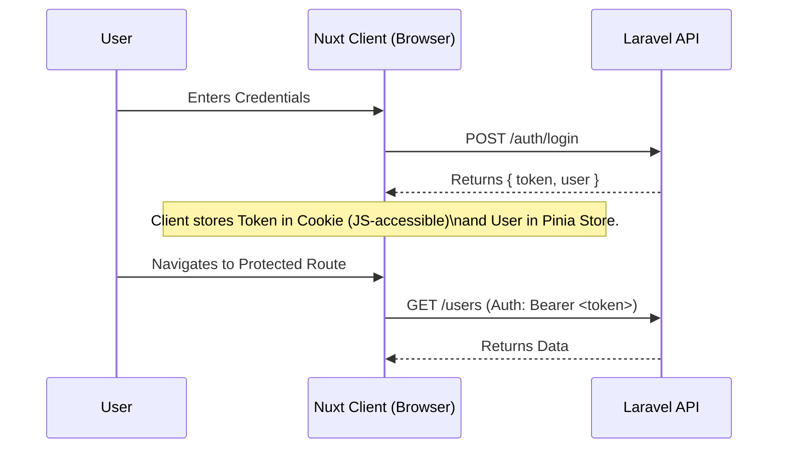

# Frontend Authentication & Authorization Architecture

## 1. Executive Summary

This document outlines the architecture for a high-performance, industry-standard authentication system for the Nuxt 4 frontend.

**Core Strategy:** **Direct API Access (Client-Side Auth)**.
To prioritize **maximum performance** and **minimal latency**, the frontend will communicate directly with the Laravel API. We will bypass the Nuxt server proxy layer to avoid the "double hop" latency.
1.  **Login:** Client sends credentials directly to Laravel.
2.  **Storage:** Token is stored in a **cookie** (accessible to JS) using Nuxt's `useCookie`. This allows for both Client-Side Rendering (CSR) and Server-Side Rendering (SSR) compatibility.
3.  **Requests:** Client reads the cookie and attaches the `Authorization: Bearer <token>` header to direct API requests.

> [!IMPORTANT]
> **Trade-off:** This approach is faster (0ms proxy overhead) but exposes the token to Cross-Site Scripting (XSS) attacks. We must mitigate this with strict Content Security Policy (CSP) and rigorous input sanitization.

---

## 2. High-Level Architecture



---

## 3. Module Breakdown

### A. State Management (`stores/auth.ts`)
*   **Responsibility:** Manage UI state (User profile, Loading status, Permissions).
*   **State:**
    *   `user: User | null`
    *   `status: 'idle' | 'loading' | 'authenticated' | 'unauthenticated'`
    *   `permissions: string[]`
*   **Actions:** `fetchUser()`, `login()`, `logout()`, `hasPermission()`.
*   **Persistence:** `user` state is hydrated from the API on load. Token is persisted in `useCookie`.

### B. Composables
*   **`useAuth()`**: High-level facade.
    *   `login(creds)`: Calls API, sets `auth_token` cookie, updates store.
    *   `logout()`: Calls API, removes cookie, clears store.
*   **`useApi()`**:
    *   Wrapper around `ofetch`.
    *   **Base URL:** Configured to external Laravel API (`config.public.apiBase`).
    *   **Interceptor:** Automatically reads `useCookie('auth_token')` and adds `Authorization` header.
    *   **Error Handling:** Intercepts 401s to trigger logout/redirect.

### C. Middleware
*   `middleware/auth.ts`: Checks `store.isAuthenticated`. If false, redirects to `/login`.
*   `middleware/guest.ts`: Checks `store.isAuthenticated`. If true, redirects to `/dashboard`.
*   `plugins/auth.ts`: Runs on app init. If `auth_token` cookie exists but `store.user` is null, it calls `fetchUser()` to restore the session.

---

## 4. Role & Ability Enforcement

We will use a granular permission-based system (RBAC) driven by the `permissions` array from the API.

### A. Route Guards
Extend `definePageMeta` to support a `permission` key.
```typescript
// middleware/auth.ts
export default defineNuxtRouteMiddleware((to) => {
  const auth = useAuthStore()
  if (!auth.isAuthenticated) return navigateTo('/login')
  
  const requiredPermission = to.meta.permission as string | undefined
  if (requiredPermission && !auth.hasPermission(requiredPermission)) {
    return navigateTo('/403') // Forbidden
  }
})
```

### B. UI Directives (`v-can`)
Create a custom directive for declarative permission checks.
```vue
<button v-can="'posts:create'">Create Post</button>
```

---

## 5. Performance & Scalability

1.  **Direct Access:** Zero intermediate hop. Lowest possible latency.
2.  **Optimistic UI:** Update local state immediately while waiting for API confirmation (e.g., "Like" button).
3.  **Parallel Fetching:** Use `Promise.all` for independent data fetches on dashboard load.
4.  **Lazy Loading:** Code-split auth logic and heavy components.

---

## 6. Testing Strategy

1.  **Unit Tests (Vitest):**
    *   `stores/auth.spec.ts`: Test state logic.
    *   `composables/useApi.spec.ts`: Mock `ofetch` to ensure headers are attached.
2.  **E2E Tests (Playwright):**
    *   Test full login flow against a mock API or staging environment.

---

## 7. Implementation Plan & Milestones

### Milestone 1: Foundation & Types
*   **Goal:** Set up structures.
*   **Tasks:**
    *   Define `User`, `AuthResponse` interfaces.
    *   Create `stores/auth.ts` (Pinia).

### Milestone 2: Core Auth Logic (Direct)
*   **Goal:** Implement login/logout/fetchUser.
*   **Tasks:**
    *   Refactor `useApi.ts` to use `useCookie('auth_token')`.
    *   Implement `useAuth.ts` with direct API calls.
    *   Create `plugins/auth.ts` for session restoration.

### Milestone 3: UI Integration
*   **Goal:** Login screens and protection.
*   **Tasks:**
    *   Create `pages/login.vue`.
    *   Implement `middleware/auth.ts`.

### Milestone 4: Permissions
*   **Goal:** RBAC.
*   **Tasks:**
    *   Implement `v-can` directive.
    *   Add permission checks to `middleware/auth.ts`.

---

## 8. Security Checklist (Revised for Direct Access)

- [ ] **XSS Prevention:**
    - [ ] Sanitize all user-generated content (e.g., using `dompurify` if rendering HTML).
    - [ ] Use `v-text` or `{{ }}` interpolation (safe by default) instead of `v-html`.
- [ ] **Content Security Policy (CSP):**
    - [ ] Implement strict CSP headers via `nuxt-security` to prevent unauthorized script execution.
- [ ] **Secure Cookies:**
    - [ ] Set `Secure` flag (HTTPS only).
    - [ ] Set `SameSite=Lax` or `Strict`.
    - [ ] *Note: Cannot use HttpOnly if we need to read it in JS, unless we use the Cookie-to-Header pattern where the server reads it, but here we are doing Client-Direct.*
- [ ] **Token Expiry:** Handle 401 errors gracefully.

## 9. Critical Analysis & Trade-offs

### A. Performance vs Security
*   **Performance:** **Optimal.** Direct connection to the backend. No proxy overhead.
*   **Security:** **Standard.** The token is accessible to JavaScript. This is the industry standard for most SPAs (React/Vue) but requires vigilance against XSS.

### B. PWA/TWA Suitability
*   **Excellent.** The architecture is stateless and relies on standard HTTP requests.
*   **Offline:** Service Workers can intercept these requests and serve cached data easily.

---

## 10. Future Feature Implementation Guide

The architecture is designed to make adding new features extremely simple and consistent.

### Scenario A: Updating User Profile
**Complexity:** Low (Standard CRUD)
1.  **Composable:** Use `useApi` (auth is auto-handled).
    ```typescript
    const updateProfile = async (data: Partial<User>) => {
      const { data: user } = await useApi<User>('/profile', { 
        method: 'PUT', 
        body: data 
      })
      authStore.setUser(user) // Update local state immediately
    }
    ```

### Scenario B: Creating a New Room
**Complexity:** Low (Protected Action)
1.  **Permission:** Ensure user has `rooms:create` permission.
    ```vue
    <button v-can="'rooms:create'" @click="createRoom">Create Room</button>
    ```
2.  **API Call:**
    ```typescript
    const createRoom = async () => {
      await useApi('/rooms', { method: 'POST', body: roomData })
      navigateTo('/rooms/active')
    }
    ```

### Scenario C: Sending Coin Requests to Resellers
**Complexity:** Medium (Real-time feedback)
1.  **Optimistic UI:** Show "Sending..." immediately.
2.  **API Call:**
    ```typescript
    const requestCoins = async (resellerId: number, amount: number) => {
      try {
        await useApi('/coins/request', { 
          method: 'POST', 
          body: { reseller_id: resellerId, amount } 
        })
        toast.success('Request sent!')
      } catch (e) {
        toast.error('Failed to send request')
      }
    }
    ```
